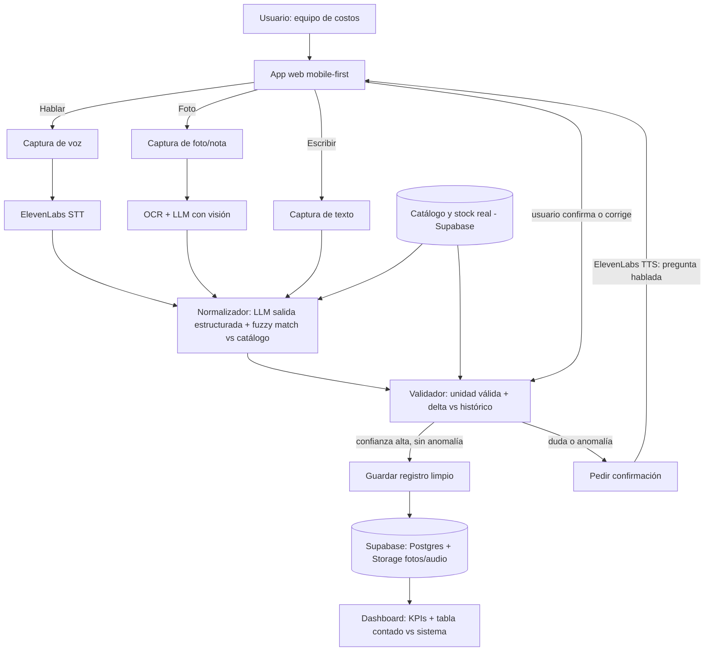

# Diagrama de arquitectura — MVP hackathon (propuesta simplificada)

> Complementa `arquitectura-v1.md`. Este es el flujo recortado al alcance real de 3 días, con las decisiones de la fase de refinamiento ya aplicadas.

## Diferencias vs. el diagrama de visión completa (`arquitectura-v1.md`)

| Visión completa | MVP hackathon |
|---|---|
| Detector de tipo genérico | Endpoint directo por botón (voz/foto/texto) |
| Orquestador de agentes (LangGraph) | Llamadas directas desde FastAPI |
| YOLO (detección de objetos entrenada) | OCR + LLM con visión |
| Digital Twin visual (mapa de bodega) | Tabla simple con badges Normal/Atención/Crítico |
| PWA offline-first | Conectividad asumida en el venue |
| Autenticación real | Usuario fijo para la demo |
| Postgres o Firebase | Postgres (Supabase) únicamente |
| Módulo decisor con LangChain | Reglas + llamada directa al LLM |
