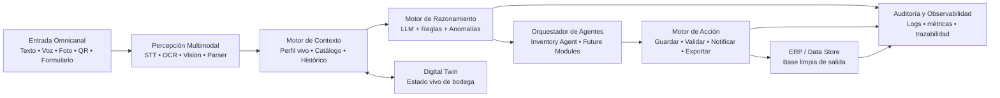
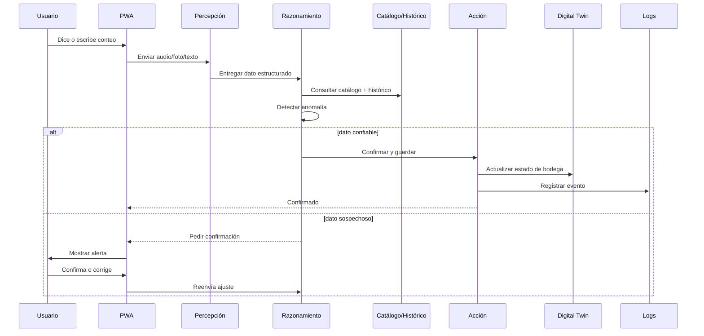

> **Nota de estado (v1):** este documento es la visión completa de producto (útil como roadmap Fase 2/3). Para el build del hackathon (3 días), el equipo acordó recortar a un slice delgado — ver checklist de refinamiento abajo antes de leer la arquitectura completa.

## Checklist de refinamiento pendiente antes de programar

- [ ] Confirmar: sin orquestador de agentes (LangGraph) — llamadas directas desde FastAPI
- [ ] Confirmar: sin Digital Twin visual (mapa de bodega) — tabla simple con badges Normal/Atención/Crítico
- [ ] Confirmar: sin PWA offline-first — asumir conectividad en el venue
- [ ] Confirmar: sin autenticación real — usuario fijo para la demo
- [ ] Confirmar: base de datos única = Postgres (Supabase), sin Firebase
- [ ] Confirmar: sin "Detector de tipo" genérico — endpoints separados por botón (voz/foto/texto)
- [ ] Confirmar: imagen usa OCR + LLM con visión (no YOLO / no detección de objetos entrenada)
- [ ] Confirmar: STT/TTS con ElevenLabs
- [ ] Confirmar: decisor por reglas + llamada directa a LLM (sin LangChain)

---

# Colsus Brain IA
## Inventory Operational Brain & Digital Twin
### Arquitectura base del OS modular para inventarios (documento de visión completo)

**Objetivo:** construir el cerebro inicial del sistema, con una base reusable para que después se conecten módulos o agentes como `Inventory Operational Brain`, `Digital Twin`, control de anomalías, reportes y futuras extensiones.

---

## 1) Principios de diseño

1. **Mobile-first / PWA local-first**
   El operario usa smartphone como interfaz principal. La app debe funcionar con conectividad intermitente y sincronizar cuando vuelva la red.

2. **Multimodal por defecto**
   La captura puede llegar por: voz, texto, foto, escaneo QR/código de barras, formulario rápido.

3. **Validación en el borde**
   La corrección ocurre antes de guardar en el sistema final. Si el dato parece raro, el sistema pregunta y bloquea el guardado hasta confirmar.

4. **El ERP no se reemplaza**
   El OS solo alimenta mejor al ERP o a la base de datos final.

5. **Arquitectura modular**
   El core se mantiene estable y los módulos se agregan como plugins o agentes.

6. **Trazabilidad total**
   Todo evento queda auditado: entrada, extracción, validación, decisión, acción y resultado.

---

## 2) Visión del producto

### Qué resuelve
- Reducir errores de captura manual.
- Evitar ambigüedad entre cantidades y unidades.
- Detectar anomalías antes del guardado.
- Generar un registro limpio y listo para ERP.
- Dar visibilidad en tiempo real del inventario y las diferencias.

### Qué no intenta hacer en el MVP
- Reemplazar el ERP actual.
- Integrarse de forma real al ERP productivo.
- Cubrir compras, recetas o pedidos de cocina.
- Resolver todos los casos de inventario desde el día 1.

---

## 3) Arquitectura macro (visión completa — no es el alcance del hackathon)



---

## 5) Flujo principal del MVP



---

## 6) Modelo de datos base

- `User`: id, name, role, permissions
- `Warehouse`: id, name, business_unit, location
- `Product`: id, sku, name, canonical_unit, category
- `InventorySession`: id, warehouse_id, user_id, started_at, closed_at, status
- `Capture`: id, session_id, source_type, raw_input, extracted_text, extracted_quantity, extracted_unit, confidence, status
- `InventoryLine`: id, session_id, product_id, counted_quantity, counted_unit, system_quantity, delta, anomaly_flag
- `Anomaly`: id, inventory_line_id, anomaly_type, severity, reason, resolved_by, resolved_at
- `AuditEvent`: id, entity_type, entity_id, action, payload, timestamp, actor

---

## 7) Reglas de negocio mínimas

1. Un producto siempre debe resolverse contra un SKU o referencia canónica.
2. Toda cantidad debe incluir unidad válida.
3. Si la confianza es baja, el sistema pregunta.
4. Si la diferencia contra histórico supera un umbral, se marca anomalía.
5. Si hay ambigüedad entre unidades, no se guarda hasta confirmar.
6. Toda confirmación humana queda auditada.

---

## 8) Contratos de entrada y salida

### Entrada
```json
{
  "session_id": "INV-2026-07-22-001",
  "source": "voice",
  "raw_input": "cinco kilos de harina",
  "warehouse_id": "BODEGA-01"
}
```

### Salida estructurada
```json
{
  "product": { "sku": "HARINA-TRIGO-25KG", "name": "Harina de trigo" },
  "quantity": 5,
  "unit": "kg",
  "confidence": 0.96,
  "validation": {
    "status": "pending_confirmation",
    "reason": "Quantity higher than expected historical range"
  }
}
```

### Registro final
```json
{
  "line_id": "IL-00045",
  "status": "confirmed",
  "counted_quantity": 5,
  "counted_unit": "kg",
  "system_quantity": 8,
  "delta": -3,
  "anomaly_flag": true
}
```

---

## 12) KPI del MVP

- Tiempo promedio de captura
- Porcentaje de registros válidos al primer intento
- Reducción de errores de digitación
- Tasa de anomalías detectadas antes del guardado
- Porcentaje de productos reconocidos correctamente
- Tiempo de cierre de inventario
- Diferencias corregidas antes de llegar al ERP

---

## 13) Roadmap por fases

**Fase 1 (hackathon):** voz/texto/foto → JSON → validación contra catálogo → alerta de anomalías → dashboard básico. *(Este es el alcance real de los 3 días de build.)*

**Fase 2 (piloto):** catálogo real completo, más bodegas, mejor digital twin, reglas por categoría, exportación a ERP.

**Fase 3 (producto):** más agentes, forecasting, recomendaciones, optimización de operaciones, analítica avanzada por unidad de negocio.

---

## 17) Mensaje de producto

> Una plataforma modular de IA que convierte captura manual en decisiones confiables, con trazabilidad completa y lista para alimentar el ERP.
